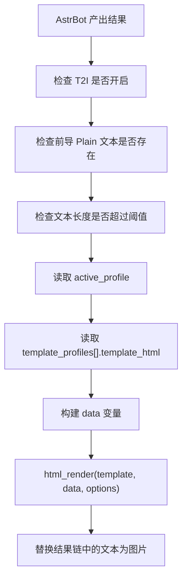

# T2I Enhance


> 一个基于 `html_render(template, data, options)` 的 AstrBot T2I 增强插件。  
> 插件自己维护模板、自己注入变量、自己执行渲染，不读取、不绑定、不接管任何官方模板内容。

## 概览

### 这是什么

`T2I Enhance` 的定位很明确：

- 它不是官方模板编辑器的补丁
- 它不是 Core 的二次封装
- 它不是“顺手给 Markdown 加点样式”的小修小补

它做的事情只有一件：

- 在命中 AstrBot T2I 条件时，使用插件自己的 HTML 模板和变量体系，把文本渲染成图片

### 这版最重要的边界

从 `v1.0.0` 开始，插件和官方模板系统彻底分离：

- 官方模板是官方模板
- 插件模板是插件模板

当前版本不会：

- 读取官方模板 HTML
- 绑定官方模板名
- 跟随官方模板切换
- 接管官方模板页里的内容

这点是本插件最容易被误解的地方，也是最需要先记住的一点。

## 为什么这样设计

核心原因不是“为了特别”，而是官方模板保存链路本身有变量白名单限制。

例如下面这些变量写进官方模板时，会遇到保存限制或无法按预期工作：

- `{{ bg_url }}`
- `{{ content | safe }}`
- `{{ datetime }}`
- 自定义变量，如 `{{ site_name }}`

这个插件的路线就是绕开那层限制：

- 模板内容改由插件配置保存
- 模板变量改由插件后端注入
- 渲染直接走 `html_render(template, data, options)`

所以当前架构不是“和官方模板联动增强”，而是“插件独立维护一套模板渲染能力”。

## 工作方式

插件触发流程很简单：



受官方影响的只有两项：

- AstrBot 的 `t2i` 总开关
- AstrBot 的 `t2i_word_threshold`

除此之外，模板内容、模板变量、背景图、截图选项、时间变量，全部由插件自己处理。

## 安装

1. 放入 AstrBot 插件目录

```text
data/plugins/astrbot_plugin_t2i_enhance
```

2. 安装依赖

```bash
pip install -r requirements.txt
```

3. 在 AstrBot WebUI 重载插件

## 版本与适用范围

- 当前版本：`v1.0.0`
- AstrBot：`>=4.26,<5`
- 支持平台：见 [metadata.yaml](C:/Users/Administrator/Desktop/astrbot_plugin_t2i_enhance/metadata.yaml:1)

## 配置结构

配置定义见 [_conf_schema.json](C:/Users/Administrator/Desktop/astrbot_plugin_t2i_enhance/_conf_schema.json:1)。

顶层只看三项：

- `plugin_enabled`
- `active_profile`
- `template_profiles`

其中：

- `plugin_enabled`：插件总开关
- `active_profile`：当前启用的模板配置名
- `template_profiles`：模板配置列表

### `template_profiles` 里的关键项

每条模板配置至少会涉及这些字段：

- `enabled`
- `name`
- `template_html`
- `render_markdown`
- `sanitize_html_input`
- `inject_datetime`
- `background_candidates`
- `background_switch_mode`
- `custom_vars_json`
- `screenshot_options_json`

不需要一开始就把所有配置都填满。真正常用的，通常只有：

- `name`
- `template_html`
- `render_markdown`
- `background_candidates`
- `background_switch_mode`
- `custom_vars_json`

## 最小可用配置

第一次接入，建议只保留一条模板配置：

```json
{
  "plugin_enabled": true,
  "active_profile": "default",
  "template_profiles": [
    {
      "enabled": true,
      "name": "default",
      "template_html": "<!doctype html><html><body><article>{{ text | safe }}</article></body></html>",
      "render_markdown": true,
      "sanitize_html_input": true,
      "inject_datetime": true,
      "background_candidates": [],
      "background_switch_mode": "random",
      "custom_vars_json": "{}",
      "screenshot_options_json": "{\"type\":\"png\",\"full_page\":true,\"animations\":\"disabled\"}"
    }
  ]
}
```

默认模板正文建议先这样写：

```html
<article>{{ text | safe }}</article>
```

先跑通，再换成更复杂的模板。

## 模板变量

插件会注入这些内置变量：

- `text`
- `raw_text`
- `content`
- `html`
- `template_name`
- `bg_url`
- `date`
- `time`
- `datetime`
- `timestamp`
- `timezone`
- `year`
- `month`
- `day`
- `hour`
- `minute`
- `second`
- `weekday`
- `version`

每条模板配置中的 `custom_vars_json` 也会一起注入。

### 变量语义

这里有几个变量最容易用错：

- `text`
  - 增强后的正文内容
  - 当前实现里会回填为渲染后的 HTML 内容
  - 默认模板直接用它也能工作
- `raw_text`
  - 原始前导文本
  - 不经过 Markdown 渲染
- `content`
  - 增强后的正文 HTML
  - 语义上比 `text` 更清楚
- `html`
  - 与 `content` 等价
- `template_name`
  - 当前命中的插件模板配置名
  - 不是官方模板名
- `bg_url`
  - 背景图候选中选出来的单个值
  - 不需要你自己在 `custom_vars_json` 重复定义

## 模板写法建议

### 1. 最省事的写法

```html
<article>{{ text | safe }}</article>
```

适合：

- 首次接入
- 先验证插件是否命中
- 不想先区分 `text / raw_text / content`

### 2. 更推荐的写法

```html
<article>{{ content | safe }}</article>
```

适合：

- 你明确知道这里想输出的是 HTML 正文
- 想让模板语义更清晰

### 3. 如果你要拿原文

```html
<article>{{ raw_text }}</article>
```

适合：

- 你不想要 Markdown 结果
- 你要自己决定原文怎么排版

## 背景图

### 基本写法

```css
background:
  linear-gradient(rgba(3, 6, 12, 0.55), rgba(3, 6, 12, 0.7)),
  url("{{ bg_url }}") center / cover no-repeat;
```

更稳的写法：

```jinja2
background:
  linear-gradient(rgba(3, 6, 12, 0.55), rgba(3, 6, 12, 0.7))
  , url("{{ bg_url }}") center / cover no-repeat;
```

### 切换模式

如果配置了多张背景图，插件支持三种模式：

- `random`
  - 每次渲染随机选一张
- `sequential`
  - 按列表顺序轮换
- `fixed`
  - 始终使用第一张

### 这个地方最容易踩坑

不要把背景图写进 `custom_vars_json` 再自己维护 `bg_url`。

正确做法是：

- 把候选 URL 放到 `background_candidates`
- 把切换策略放到 `background_switch_mode`
- 模板里直接使用 `{{ bg_url }}`

## 时间变量

如果开启了 `inject_datetime`，可直接使用：

```html
<span>{{ date }}</span>
<span>{{ time }}</span>
<span>{{ datetime }}</span>
```

格式由这些配置决定：

- `timezone`
- `datetime_format`
- `date_format`
- `time_format`

## 自定义变量

`custom_vars_json` 是一段 JSON 对象，键名会直接成为模板变量。

例如：

```json
{
  "site_name": "AstrBot",
  "theme_name": "T2I Enhance",
  "footer_text": "Generated by plugin"
}
```

模板中可以直接使用：

```html
<footer>{{ footer_text }}</footer>
```

### 限制

- 键名必须是合法变量名
- 不能覆盖内置保留变量
- 深层复杂结构会做最小清洗

保留变量包括：

- `text`
- `raw_text`
- `content`
- `html`
- `template_name`
- `bg_url`
- `date`
- `time`
- `datetime`
- `timestamp`
- `timezone`
- `year`
- `month`
- `day`
- `hour`
- `minute`
- `second`
- `weekday`
- `version`

## 截图选项

插件最终是通过 `html_render(..., options=...)` 截图的。

默认值：

```json
{
  "type": "png",
  "full_page": true,
  "animations": "disabled"
}
```

目前只支持插件内部允许的截图参数子集，超出的键会被忽略。

最常用的仍然是这几个：

- `type`
- `full_page`
- `animations`
- `quality`
- `timeout`

## 模板安全校验

插件在读取模板配置时会做最小安全校验。

命中以下危险模式的模板会被直接跳过：

- Jinja2 dunder 链访问，如 `__class__`
- `os.xxx`
- `subprocess`
- `.popen(`
- `eval(`
- `exec(`
- Flask 上下文对象，如 `config`、`request`、`session`、`g`
- `<script>` 标签
- `javascript:` URL

这不是通用模板沙箱，只是最小保护。

真实含义是：

- 正常 HTML/CSS 模板可以写
- 明显危险的模板内容不会进入渲染流程

## 这个插件最容易被误解的点

这一段比普通“注意事项”更重要，因为这些坑通常只有真正折腾过后才会意识到。

### 1. 改官方模板页，对本插件没用

这是当前版本最核心的事实。

你在官方模板页里修改：

- `{{ bg_url }}`
- `{{ datetime }}`
- `{{ content | safe }}`

都不会影响本插件。

因为本插件根本不读官方模板内容。

### 2. `active_profile` 才是实际入口

插件选模板不是靠“官方当前模板名”，而是靠：

- 顶层 `active_profile`
- 匹配 `template_profiles[].name`

如果这两个对不上，插件就不会使用你以为的那套模板。

### 3. 看起来“插件没生效”，很多时候其实是模板没接收增强结果

这是非常典型的误判点。

如果你用了插件，但模板正文没有接增强后的变量输出，例如正文位置没写：

```html
{{ text | safe }}
```

或者：

```html
{{ content | safe }}
```

那你会误以为：

- Markdown 渲染失效了
- 变量注入失效了
- 插件没工作

实际上可能只是模板没把增强结果渲染出来。

### 4. `text` 和 `content` 不是“随便两个名字”

当前实现里它们都能用，但语义不同：

- `text` 更偏“兼容默认模板写法”
- `content` 更偏“明确输出 HTML 正文”

如果模板已经进入稳定阶段，优先建议用：

```html
{{ content | safe }}
```

### 5. 阈值不是你配置多少就一定按多少跑

AstrBot Core 会对 `t2i_word_threshold` 做最小保护：

- 小于 `50` 的值，最终按 `50` 生效
- 非数字时，回退到 `150`

所以有些“为什么短文本没触发 / 为什么触发时机不对”的问题，不一定是插件问题，而是阈值本身就被 Core 修正了。

### 6. 插件处理的是结果链前导 `Plain`

当前逻辑只收集结果链开头连续的 `Plain` 文本。

这意味着：

- 如果前面不是 `Plain`
- 或者中间被其他组件打断

那插件看到的可渲染文本就可能不是你想的那一整段。

这个点很容易被忽视，但它是判断“为什么没触发”的关键线索之一。

## 排查顺序

如果你发现“没触发”“没渲染”“Markdown 像失效”，建议按下面顺序排查：

1. `plugin_enabled` 是否开启
2. AstrBot 的 `t2i` 是否开启
3. 当前文本长度是否超过实际生效阈值
4. `active_profile` 是否和某条已启用 `template_profiles[].name` 匹配
5. 该 profile 的 `template_html` 是否非空
6. 正文位置是否真的输出了 `{{ text | safe }}` 或 `{{ content | safe }}`
7. `render_markdown` 是否按预期开启
8. `background_candidates` 和 `background_switch_mode` 是否正确
9. 模板内容是否命中了插件的最小安全校验
10. 输入结果链前导部分是否真的是连续 `Plain`

## 与官方实现的对应关系

本插件当前实现对照了 AstrBot 官方文档与 Core 行为，关键事实如下：

- 官方支持 `html_render(template, data, options)`
- `data` 确实作为 Jinja2 模板变量进入渲染
- 默认 `t2i_word_threshold` 为 `150`
- Core 会把 `t2i_word_threshold` 最低保护到 `50`
- `on_decorating_result` 可以直接改结果链

所以这套实现是“在官方允许的插件能力范围内独立渲染”，不是对 Core 做侵入修改。

## 示例

### 示例 1：最小正文模板

```html
<!doctype html>
<html>
<head>
  <meta charset="utf-8"/>
  <title>Simple</title>
</head>
<body>
  <article>{{ content | safe }}</article>
</body>
</html>
```

### 示例 2：带背景图和时间

```html
<!doctype html>
<html>
<head>
  <meta charset="utf-8"/>
  <title>Card</title>
  <style>
    body {
      margin: 0;
      min-height: 100vh;
      color: white;
      background:
        linear-gradient(rgba(7, 12, 20, 0.45), rgba(7, 12, 20, 0.7))
        , url("{{ bg_url }}") center / cover no-repeat;
      font-family: "Microsoft YaHei", sans-serif;
    }
    .wrap {
      padding: 48px;
    }
    .meta {
      opacity: 0.82;
      margin-bottom: 18px;
      font-size: 14px;
    }
  </style>
</head>
<body>
  <div class="wrap">
    <div class="meta">{{ datetime }}</div>
    <article>{{ content | safe }}</article>
  </div>
</body>
</html>
```

### 示例 3：配套自定义变量

`custom_vars_json`：

```json
{
  "title": "日报",
  "subtitle": "Daily Report"
}
```

模板：

```html
<header>
  <h1>{{ title }}</h1>
  <p>{{ subtitle }}</p>
</header>
<article>{{ content | safe }}</article>
```

## 变更记录

见 [CHANGELOG.md](C:/Users/Administrator/Desktop/astrbot_plugin_t2i_enhance/CHANGELOG.md:1)。

## 许可证

本仓库使用 [MIT License](C:/Users/Administrator/Desktop/astrbot_plugin_t2i_enhance/LICENSE:1)。
