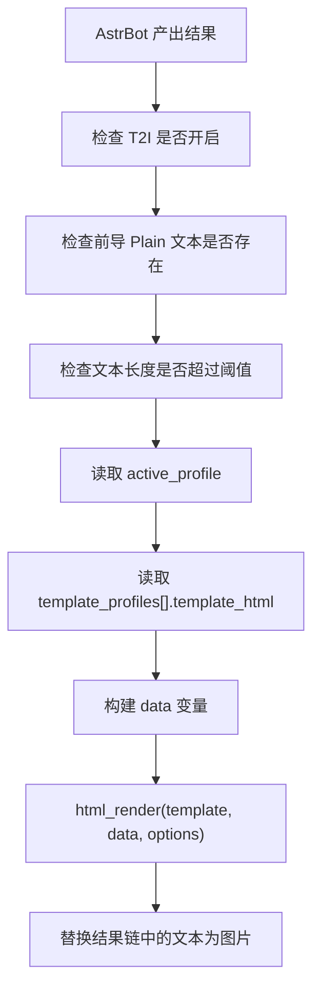
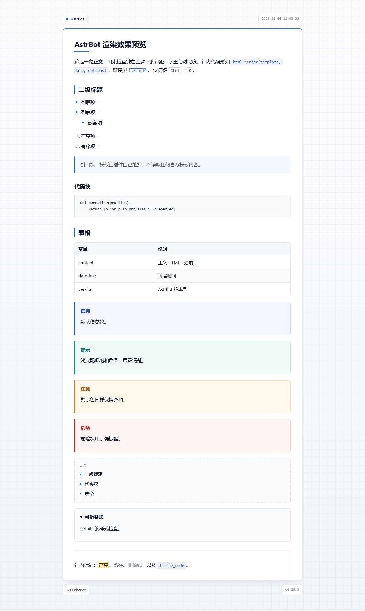

# T2I Enhance


> 一个基于 `html_render(template, data, options)` 的 AstrBot T2I 增强插件。  
> 插件自己维护模板、自己注入变量、自己执行渲染，不读取、不绑定、不接管任何官方模板内容。

## 概览

### 这是什么

`T2I Enhance` 的定位很明确：

- 它不是官方模板编辑器的补丁
- 它不是 Core 的二次封装
- 它不是“顺手给 Markdown 加点样式”的小修小补

它做的事情只有一件：

- 在命中 AstrBot T2I 条件时，使用插件自己的 HTML 模板和变量体系，把文本渲染成图片

### 这版最重要的边界

从 `v1.0.0` 开始，插件和官方模板系统彻底分离：

- 官方模板是官方模板
- 插件模板是插件模板

当前版本不会：

- 读取官方模板 HTML
- 绑定官方模板名
- 跟随官方模板切换
- 接管官方模板页里的内容

这点是本插件最容易被误解的地方，也是最需要先记住的一点。

## 为什么这样设计

核心原因不是“为了特别”，而是官方模板保存链路本身有变量白名单限制。

例如下面这些变量写进官方模板时，会遇到保存限制或无法按预期工作：

- `{{ bg_url }}`
- `{{ content | safe }}`
- `{{ datetime }}`
- 自定义变量，如 `{{ site_name }}`

这个插件的路线就是绕开那层限制：

- 模板内容改由插件配置保存
- 模板变量改由插件后端注入
- 渲染直接走 `html_render(template, data, options)`

所以当前架构不是“和官方模板联动增强”，而是“插件独立维护一套模板渲染能力”。

## 工作方式

插件触发流程很简单：


```mermaid
flowchart TD
    A["AstrBot 产出结果"] --> B["检查 T2I 是否开启"]
    B --> C["检查前导 Plain 文本是否存在"]
    C --> D["检查文本长度是否超过阈值"]
    D --> E["读取 active_profile"]
    E --> F["读取 template_profiles[].template_html"]
    F --> G["构建 data 变量"]
    G --> H["html_render(template, data, options)"]
    H --> I["替换结果链中的文本为图片"]
```

受官方影响的只有两项：

- AstrBot 的 `t2i` 总开关
- AstrBot 的 `t2i_word_threshold`

除此之外，模板内容、模板变量、背景图、截图选项、时间变量，全部由插件自己处理。

## 安装

1. 放入 AstrBot 插件目录

```text
data/plugins/astrbot_plugin_t2i_enhance
```

2. 安装依赖

```bash
pip install -r requirements.txt
```

3. 在 AstrBot WebUI 重载插件

## 版本与适用范围

- 当前版本：`v1.2.0`
- AstrBot：`>=4.26,<5`
- 支持平台：见 [metadata.yaml](metadata.yaml)

## 兼容性与部署

### 部署形态

这个插件不依赖 Docker 本身。

理论上以下形态都可以使用：

- AstrBot 源码部署
- AstrBot Docker 部署
- AstrBot 与 t2i server 分离部署
- AstrBot 与 t2i server 使用 Docker Compose 联合部署

决定插件能不能工作的关键，不是“是不是 Docker”，而是：

- AstrBot 是否能正常调用 `html_render(template, data, options)`
- 对应的 HTML 渲染服务是否可用

### `remote` 与 `local`

这里需要单独说清楚，因为它和官方默认 T2I 的直觉不完全一样。

- 这个插件可以正常工作在 `remote` 路线下
- 这个插件不能按“官方 local 文转图”那套逻辑保证可用

原因是：

- 插件调用的是 `html_render(...)`
- `html_render(...)` 当前走的是 HTML 远程渲染链路
- 官方 `t2i_strategy = local` 对应的是默认 `render_t2i()` 的本地 PIL 渲染，不是 HTML 模板渲染

所以更准确地说：

- `remote`：可用
- 自部署 t2i server：可用
- 官方远程 t2i 服务：可用
- 仅启用官方 `local` PIL 文转图、但没有可用 HTML 渲染端点：不保证可用

### 对实际使用的建议

如果你准备长期使用这个插件，建议按下面理解：

- 它兼容不同部署方式
- 但它依赖的是 HTML 渲染服务能力，不是官方本地 PIL 文转图能力
- 只要 HTML 渲染端点可用，Docker 与非 Docker 都不是问题

## 配置结构

配置定义见 [_conf_schema.json](_conf_schema.json)。

顶层只看四项：

- `plugin_enabled`
- `fallback_to_core_t2i`
- `active_profile`
- `template_profiles`

其中：

- `plugin_enabled`：插件总开关
- `fallback_to_core_t2i`：插件渲染失败时是否交回 Core 渲染（默认关闭，见下文「渲染失败时的取舍」）
- `active_profile`：当前启用的模板配置名
- `template_profiles`：模板配置列表

### `template_profiles` 里的关键项

每条模板配置至少会涉及这些字段：

- `enabled`
- `name`
- `template_file`
- `template_html`
- `render_markdown`
- `sanitize_html_input`
- `inject_datetime`
- `background_candidates`
- `background_switch_mode`
- `custom_vars_json`
- `screenshot_options_json`

不需要一开始就把所有配置都填满。真正常用的，通常只有：

- `name`
- `template_html`（或 `template_file`）
- `render_markdown`
- `background_candidates`
- `background_switch_mode`
- `custom_vars_json`

### 用 `template_file` 代替 `template_html`

模板动辄几百行，粘进 WebUI 文本框既难维护也容易粘坏。把模板文件放进插件目录（例如 `templates/`），然后只写路径：

```json
{
  "enabled": true,
  "name": "frosted",
  "template_file": "templates/frosted-glass.html"
}
```

规则：

- 路径**相对于插件目录**解析，并且必须落在插件目录内。绝对路径、`..` 穿越、其他盘符、解析后指向外部的符号链接都会被拒绝并告警。
- 文件可读时**优先于 `template_html`**。所以只填 `template_file`、把 `template_html` 留成默认占位内容就能正常工作。
- 文件读不到（路径写错、文件被删、不是 UTF-8）时会告警并回退到 `template_html`；两者都拿不到内容时该条配置被跳过。
- 模板文件的**修改时间与大小**参与缓存指纹，改完文件下一次渲染就生效，无需重载插件。
- 支持 UTF-8 BOM（用 `utf-8-sig` 解码），编辑器自动加 BOM 不会污染模板。

## 最小可用配置

第一次接入，建议只保留一条模板配置：

```json
{
  "plugin_enabled": true,
  "active_profile": "default",
  "template_profiles": [
    {
      "enabled": true,
      "name": "default",
      "template_html": "<!doctype html><html><body><article>{{ text | safe }}</article></body></html>",
      "render_markdown": true,
      "sanitize_html_input": true,
      "inject_datetime": true,
      "background_candidates": [],
      "background_switch_mode": "random",
      "custom_vars_json": "{}",
      "screenshot_options_json": "{\"type\":\"png\",\"full_page\":true,\"animations\":\"disabled\"}"
    }
  ]
}
```

默认模板正文建议先这样写：

```html
<article>{{ text | safe }}</article>
```

先跑通，再换成更复杂的模板。

## 模板变量

插件会注入这些内置变量：

- `text`
- `raw_text`
- `content`
- `html`
- `template_name`
- `bg_url`
- `date`
- `time`
- `datetime`
- `timestamp`
- `timezone`
- `year`
- `month`
- `day`
- `hour`
- `minute`
- `second`
- `weekday`
- `version`

每条模板配置中的 `custom_vars_json` 也会一起注入。

### 变量语义

这里有几个变量最容易用错：

- `text`
  - 增强后的正文内容
  - 当前实现里会回填为渲染后的 HTML 内容
  - 默认模板直接用它也能工作
- `raw_text`
  - 原始前导文本
  - 不经过 Markdown 渲染
- `content`
  - 增强后的正文 HTML
  - 语义上比 `text` 更清楚
- `html`
  - 与 `content` 等价
- `template_name`
  - 当前命中的插件模板配置名
  - 不是官方模板名
- `bg_url`
  - 背景图候选中选出来的单个值
  - 不需要你自己在 `custom_vars_json` 重复定义

## 模板写法建议

### 1. 最省事的写法

```html
<article>{{ text | safe }}</article>
```

适合：

- 首次接入
- 先验证插件是否命中
- 不想先区分 `text / raw_text / content`

### 2. 更推荐的写法

```html
<article>{{ content | safe }}</article>
```

适合：

- 你明确知道这里想输出的是 HTML 正文
- 想让模板语义更清晰

### 3. 如果你要拿原文

```html
<article>{{ raw_text }}</article>
```

适合：

- 你不想要 Markdown 结果
- 你要自己决定原文怎么排版

## 背景图

### 基本写法

```css
background:
  linear-gradient(rgba(3, 6, 12, 0.55), rgba(3, 6, 12, 0.7)),
  url("{{ bg_url }}") center / cover no-repeat;
```

更稳的写法：

```jinja2
background:
  linear-gradient(rgba(3, 6, 12, 0.55), rgba(3, 6, 12, 0.7))
  , url("{{ bg_url }}") center / cover no-repeat;
```

### 切换模式

如果配置了多张背景图，插件支持三种模式：

- `random`
  - 每次渲染随机选一张
  - 候选多于一张时，会尽量避开上一次用过的那张
- `sequential`
  - 按列表顺序轮换，每个模板配置各自维护游标
- `fixed`
  - 始终使用第一张

`background_switch_mode` 的大小写与首尾空格会被忽略，`Random`、` random ` 都等同于 `random`。

### 候选 URL 的校验时机

`background_candidates` 在配置加载阶段就会完成校验与去重：

- 只保留带有 scheme 的绝对 URL，相对路径会被丢弃
- scheme 必须在 `allowed_protocols` 内，否则该条会被跳过并告警
- 重复 URL 只保留第一条

因此非法候选只会在配置变化后告警一次，不会每条消息都刷日志。

### 这个地方最容易踩坑

不要把背景图写进 `custom_vars_json` 再自己维护 `bg_url`。

正确做法是：

- 把候选 URL 放到 `background_candidates`
- 把切换策略放到 `background_switch_mode`
- 模板里直接使用 `{{ bg_url }}`

## 时间变量

如果开启了 `inject_datetime`，可直接使用：

```html
<span>{{ date }}</span>
<span>{{ time }}</span>
<span>{{ datetime }}</span>
```

格式由这些配置决定：

- `timezone`
- `datetime_format`
- `date_format`
- `time_format`

## 自定义变量

`custom_vars_json` 是一段 JSON 对象，键名会直接成为模板变量。

例如：

```json
{
  "site_name": "AstrBot",
  "theme_name": "T2I Enhance",
  "footer_text": "Generated by plugin"
}
```

模板中可以直接使用：

```html
<footer>{{ footer_text }}</footer>
```

### 限制

- 键名必须是合法变量名
- 不能覆盖内置保留变量
- 深层复杂结构会做最小清洗

保留变量包括：

- `text`
- `raw_text`
- `content`
- `html`
- `template_name`
- `bg_url`
- `date`
- `time`
- `datetime`
- `timestamp`
- `timezone`
- `year`
- `month`
- `day`
- `hour`
- `minute`
- `second`
- `weekday`
- `version`

## 截图选项

插件最终是通过 `html_render(..., options=...)` 截图的。

默认值：

```json
{
  "type": "png",
  "full_page": true,
  "animations": "disabled"
}
```

目前只支持插件内部允许的截图参数子集，超出的键会被忽略。

最常用的仍然是这几个：

- `type`
- `full_page`
- `animations`
- `quality`
- `timeout`

## 配置生效与性能

### 归一化结果会被缓存

插件在首次命中渲染时，会把 `template_profiles` 归一化成内部配置对象：

- 模板安全校验
- HTML 清洗白名单
- 截图选项与自定义变量解析
- 背景图候选去重与协议校验
- 时区对象

这份结果按原始配置内容的指纹缓存。配置没变时，后续每条消息直接复用，不再重复做正则扫描与 JSON 解析；在 WebUI 里改完配置后，下一次渲染会自动使用新配置，不需要手动重载插件。

用 `template_file` 的配置会把模板文件的修改时间与大小一起算进指纹，所以直接编辑 `templates/` 下的文件，同样下一次渲染就生效。

### 解析失败时的降级

配置里某一项写错，不会连带毁掉其他项：

| 配置项 | 出错时的行为 |
| --- | --- |
| `template_file` | 路径逃逸、文件不存在或读取失败时告警，并回退到 `template_html` |
| `template_html` | 命中安全校验则该条配置被跳过并告警 |
| `allowed_tags` | 类型不对或全部非法时回退到默认白名单 |
| `allowed_attributes_json` | JSON 非法时回退到默认白名单；显式填 `{}` 表示不放行任何属性 |
| `allowed_protocols` | 为空或全部非法时回退到 `http` / `https` / `data` |
| `markdown_extensions` | 无法加载的扩展被剔除并告警，其余继续生效 |
| `screenshot_options_json` | 非法键与非法取值被忽略，其余继续生效 |
| `custom_vars_json` | 非法键名与保留变量名被忽略，其余继续注入 |
| `background_candidates` | 非法 URL 被剔除，其余继续参与切换 |
| `timezone` | 无效时区回退到 `UTC` 并告警 |
| 日期时间格式 | 非法 `strftime` 指令回退到默认格式并告警 |

### 渲染失败时的取舍

插件渲染失败（HTML 端点不可用、Playwright 超时、截图选项被拒等）时有两种走向，由顶层开关 `fallback_to_core_t2i` 决定：

| 取值 | 行为 | 适用 |
| --- | --- | --- |
| `false`（默认） | 直接发送纯文本，并把该条结果的 `use_t2i_` 置为 `false`，抑制 Core 再渲染一次 | T2I 完全依赖本插件时；同时避免同一条消息渲染两次的额外延迟 |
| `true` | 保留 T2I 标记，交回 Core 用它自己的官方模板渲染 | 使用 `t2i_strategy=local` 这类不依赖 HTML 端点的 Core 渲染时，插件失败仍能拿到一张图 |

默认值与 v1.1.0 行为一致，升级不会改变现有表现。

### 默认白名单与默认 Markdown 扩展是对齐的

默认 `allowed_tags` / `allowed_attributes_json` 覆盖了默认 `markdown_extensions` 实际会产出的结构：

- `admonition` 输出 `<div class="admonition note">` 与 `<p class="admonition-title">`。因此 `p` 必须放行 `class`，否则警示框标题的类会被 bleach 剥掉，模板里写的 `.admonition-title` 样式会静默失效。
- `extra` 会输出定义列表 `<dl>` / `<dt>` / `<dd>`。
- 代码块 `<pre class="...">` / `<code class="...">` 的 `class` 要保留，Shiki 高亮依赖它。

如果你自定义了这两项又保留了默认扩展，注意别把上面的标签或类裁掉。

### 一次渲染只收集一次正文

结果链前导 `Plain` 文本只收集一次，同时用于判定阈值与生成模板数据。
阈值判定用的是与 Core 一致的 `"\n\n"` 拼接串，而传给模板的 `raw_text` / `content` 会去掉开头换行。

## 模板安全校验

插件在读取模板配置时会做最小安全校验，命中危险模式的模板会被直接跳过并回退为纯文本。

校验分两层，目的是在拦住真实攻击面的同时尽量避免误判：

### 1. HTML 层（扫描整份模板）

- `<script>`
- `<iframe>`
- `<object>`、`<embed>`、`<applet>`
- 内联事件属性，如 `onclick=`、`onerror=`
- `javascript:`、`vbscript:` URL
- `data:text/html`

### 2. Jinja 层（只扫描 `{{ ... }}` 与 `` 内部）

- dunder 链访问，如 `__class__`、`__globals__`
- 模块属性访问，如 `os.`、`subprocess.`、`importlib.`
- 代码执行，如 `eval(`、`exec(`、`popen(`、`open(`
- 命名空间自省，如 `getattr(`、`globals(`
- `|attr(` 过滤器
- 模板自省对象，如 `self`、`lipsum`、`cycler`
- Flask 上下文对象，如 `config`、`request`、`session`、`g`
- 模板加载，如 ``、``、``、``

### 为什么只扫 Jinja 内部

代码执行类模式只在 Jinja 表达式里才有意义。如果对整个模板文本做匹配，普通内容会被误伤，例如：

```css
background: url("https://example.com/photos.png");
```

这里的 `photos.png` 含有 `os.` 子串，旧版本会因此把整份模板判定为不安全并跳过。现在这类误判不会发生。

### 边界

这不是通用模板沙箱，只是最小保护。

真实含义是：

- 正常 HTML/CSS 模板可以写
- 明显危险的模板内容不会进入渲染流程
- `template_html` 仍然应当视为可信输入，不要直接粘贴来源不明的模板

## 这个插件最容易被误解的点

这一段比普通“注意事项”更重要，因为这些坑通常只有真正折腾过后才会意识到。

### 1. 改官方模板页，对本插件没用

这是当前版本最核心的事实。

你在官方模板页里修改：

- `{{ bg_url }}`
- `{{ datetime }}`
- `{{ content | safe }}`

都不会影响本插件。

因为本插件根本不读官方模板内容。

### 2. `active_profile` 才是实际入口

插件选模板不是靠“官方当前模板名”，而是靠：

- 顶层 `active_profile`
- 匹配 `template_profiles[].name`

如果这两个对不上，插件就不会使用你以为的那套模板。

### 3. 看起来“插件没生效”，很多时候其实是模板没接收增强结果

这是非常典型的误判点。

如果你用了插件，但模板正文没有接增强后的变量输出，例如正文位置没写：

```html
{{ text | safe }}
```

或者：

```html
{{ content | safe }}
```

那你会误以为：

- Markdown 渲染失效了
- 变量注入失效了
- 插件没工作

实际上可能只是模板没把增强结果渲染出来。

### 4. `text` 和 `content` 不是“随便两个名字”

当前实现里它们都能用，但语义不同：

- `text` 更偏“兼容默认模板写法”
- `content` 更偏“明确输出 HTML 正文”

如果模板已经进入稳定阶段，优先建议用：

```html
{{ content | safe }}
```

### 5. 阈值不是你配置多少就一定按多少跑

AstrBot Core 会对 `t2i_word_threshold` 做最小保护：

- 小于 `50` 的值，最终按 `50` 生效
- 非数字时，回退到 `150`

所以有些“为什么短文本没触发 / 为什么触发时机不对”的问题，不一定是插件问题，而是阈值本身就被 Core 修正了。

### 6. 插件处理的是结果链前导 `Plain`

当前逻辑只收集结果链开头连续的 `Plain` 文本。

这意味着：

- 如果前面不是 `Plain`
- 或者中间被其他组件打断

那插件看到的可渲染文本就可能不是你想的那一整段。

这个点很容易被忽视，但它是判断“为什么没触发”的关键线索之一。

## 排查顺序

如果你发现“没触发”“没渲染”“Markdown 像失效”，建议按下面顺序排查：

1. `plugin_enabled` 是否开启
2. AstrBot 的 `t2i` 是否开启
3. 当前文本长度是否超过实际生效阈值
4. `active_profile` 是否和某条已启用 `template_profiles[].name` 匹配
5. 该 profile 的 `template_html` 或 `template_file` 至少有一项能提供内容（`template_file` 必须在插件目录内且文件存在）
6. 正文位置是否真的输出了 `{{ text | safe }}` 或 `{{ content | safe }}`
7. `render_markdown` 是否按预期开启
8. `background_candidates` 和 `background_switch_mode` 是否正确
9. 模板内容是否命中了插件的最小安全校验
10. 输入结果链前导部分是否真的是连续 `Plain`

日志里可以直接找到这几类线索：

- `skip:` 开头的 `DEBUG` 日志会写明跳过的具体原因（插件关闭、T2I 未开启、无前导 `Plain`、未超阈值）
- `active_profile %r matches no enabled profile` 说明模板配置名写错了，插件已回落到第一条已启用配置
- `blocked unsafe template profile` 说明模板被安全校验拦下，括号里是具体命中的规则名
- `selected background` 会打出本次选中的背景图与候选数量
- `drop unusable markdown extension` / `ignore invalid value for screenshot option` 说明相关配置项被忽略

## 与官方实现的对应关系

本插件当前实现对照了 AstrBot 官方文档与 Core 行为，关键事实如下：

- 官方支持 `html_render(template, data, options)`
- `data` 确实作为 Jinja2 模板变量进入渲染
- 默认 `t2i_word_threshold` 为 `150`
- Core 会把 `t2i_word_threshold` 最低保护到 `50`
- Core 的 `ResultDecorateStage` 同样只取结果链开头连续的 `Plain`，并用 `"\n\n"` 连接
- `on_decorating_result` 可以直接改结果链
- `html_render` 的 `umo` 参数在较新版本上才存在，插件会先探测再传

插件对触发条件的判断刻意与 Core 保持一致：`plan` 阶段用的开关判断、前导 `Plain` 收集方式、`"\n\n"` 分隔符与阈值比较逻辑都对齐 `ResultDecorateStage`，因此插件只会在 Core 本来就会走 T2I 的情况下接管渲染。

差异只在渲染本身：Core 用官方模板，插件用 `template_profiles` 里自维护的模板与变量。

所以这套实现是“在官方允许的插件能力范围内独立渲染”，不是对 Core 做侵入修改；同时它依赖的是 HTML 渲染链路，而不是官方 `local` PIL T2I 链路。

## 示例

### 开箱可用的完整模板

仓库 `templates/` 目录下放了三套完整设计。用 `template_file` 直接引用即可，不必把模板内容粘进 `template_html`：

```json
{ "enabled": true, "name": "frosted", "template_file": "templates/frosted-glass.html" }
```

- [templates/frosted-glass.html](templates/frosted-glass.html) —— 浅色清爽风：白底淡方格 + 方正白卡与实色标尺，文档式排版，无圆形装饰
- [templates/aurora-glass.html](templates/aurora-glass.html) —— 深色极光玻璃卡，适合技术向输出
- [templates/paper-light.html](templates/paper-light.html) —— 浅色纸质排版，适合长文阅读

三套都覆盖了 Markdown 的标题、列表、引用、代码块、表格、`details`、`admonition`、`toc` 等元素样式，并且都已通过插件自身的安全校验。想整份复制进 `template_html` 也可以。

下面是 `templates/frosted-glass.html` 的实际渲染效果（正文为一段覆盖各类 Markdown 元素的样例文本）：



它们使用的变量：

| 变量 | 说明 |
| --- | --- |
| `content` | 正文 HTML，必填 |
| `datetime` | 页眉时间，`inject_datetime` 关闭时自动隐藏 |
| `version` | AstrBot 版本号 |
| `site_name` | 页眉品牌名，缺省显示 `AstrBot` |
| `theme_name` | 页脚文案，缺省值即为默认配置里的 `T2I Enhance` |
| `footer_text` | 可选，填了会覆盖页脚的 `theme_name` |
| `bg_url` | 可选，留空则不铺背景图 |

对应的 `custom_vars_json`：

```json
{
  "site_name": "AstrBot",
  "theme_name": "T2I Enhance",
  "footer_text": "Generated by T2I Enhance"
}
```

### 示例 1：最小正文模板

```html
<!doctype html>
<html>
<head>
  <meta charset="utf-8"/>
  <title>Simple</title>
</head>
<body>
  <article>{{ content | safe }}</article>
</body>
</html>
```

### 示例 2：带背景图和时间

```html
<!doctype html>
<html>
<head>
  <meta charset="utf-8"/>
  <title>Card</title>
  <style>
    body {
      margin: 0;
      min-height: 100vh;
      color: white;
      background:
        linear-gradient(rgba(7, 12, 20, 0.45), rgba(7, 12, 20, 0.7))
        , url("{{ bg_url }}") center / cover no-repeat;
      font-family: "Microsoft YaHei", sans-serif;
    }
    .wrap {
      padding: 48px;
    }
    .meta {
      opacity: 0.82;
      margin-bottom: 18px;
      font-size: 14px;
    }
  </style>
</head>
<body>
  <div class="wrap">
    <div class="meta">{{ datetime }}</div>
    <article>{{ content | safe }}</article>
  </div>
</body>
</html>
```

### 示例 3：配套自定义变量

`custom_vars_json`：

```json
{
  "title": "日报",
  "subtitle": "Daily Report"
}
```

模板：

```html
<header>
  <h1>{{ title }}</h1>
  <p>{{ subtitle }}</p>
</header>
<article>{{ content | safe }}</article>
```

## 变更记录

见 [CHANGELOG.md](CHANGELOG.md)。

## 许可证

本仓库使用 [MIT License](LICENSE)。
